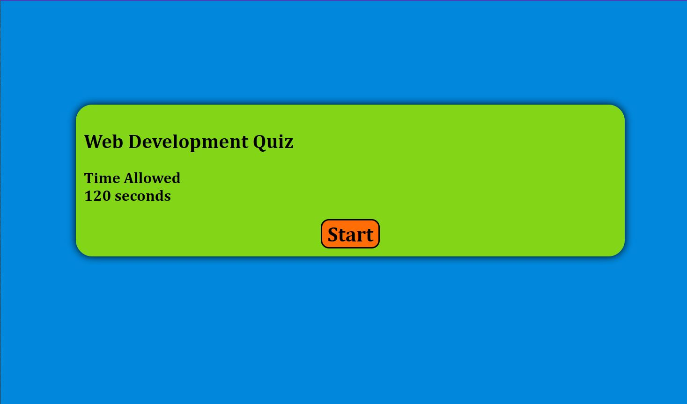

# Young-Challenge-4
# Coding a Quiz 
## This Project is a start from scratch format for Student to build and deployed Quiz app. Student were require to code HTML, apply CSS style an JavaScript to build webpage to ensure they are function. Task was to feature dynamically updated HTML and CSS,  make sure the quiz includes both multiple-choice questions and interactive codes for user experience abdd to improve the aesthetics for user as well as responsive layout that adapts to different view port.
---
___
## Goal of this Project 
* Create a Array of questions object . 
* Assign proper Classes and ID while applying Flexes , margin, padding  characteristics to improve aesthetic. 
* set Timer interval, Punish if wrong by -5 second, if answer correct + 5second extra. 
* Show if user win or lose at the end of the questions list.
* Reorganize the page structure to follow semantic structure of the HTML elements
* Dynamically update HTML and CSS per user input. 
* Deployed Page to Github. 
> I spend most of the time working on the styling, setting Questions object in the Arrays and writing the Logic to enable the question to generate. It was took alot of time to go through at first but after reviewing and help from Instructor/TAs, the logic became more clear and I was able to apply the concept and made it work. 
---
___

## Project Content

* [Github.com/Young-Chhay/Young-Challenge-4](https://github.com/Young-Chhay/Young-Challenge-4 "Young's Github Page")

* [Deployed Webpage - (challenge-4)](https://young-chhay.github.io/Young-Challenge-4/ "Challenge-4's Webpage")

---
___